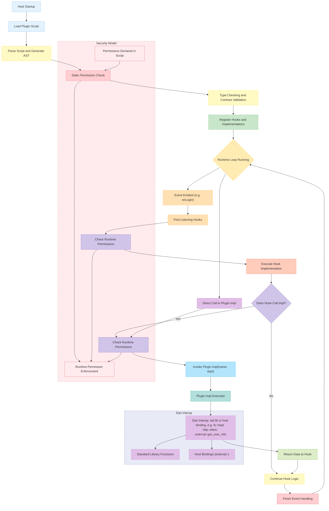

# Dscript

**Table of Contents**

- [Language Reference](language-ref/introduction.md)  
- [Contracts & Dart](contracts-dart/defining-contracts.md)

Welcome to the documentation for **Dscript**, a small DSL (Domain-Specific Language) designed to let you write “plugin” scripts that integrate seamlessly with a Dart/Flutter host.  
Here you’ll find:

- **Using the Language**: How to write `.dscript` files, DSL syntax, built-in types, and examples.
- **Contracts & Dart**: How to define a contract in Dart, load and run a script at runtime, and bind host functions.

> If you’re already comfortable with the language, jump to [Defining Contracts](contracts-dart/defining-contracts.md) to learn how to bridge your Dart code to Dscript.  
> Otherwise, start at [Introduction](language-ref/introduction.md).

## Architecture Overview

### Initialization & Static Analysis

1. **Host Startup**

   - Host initializes its plugin subsystem.

2. **Load & Parse Script**

   - Reads the `.dscript` file and parses it into an AST containing contracts, functions, hooks, and permissions.

3. **Static Permission Check**

   - Extracts declared permissions (e.g., `fs::read`, `http::client`, `external::get_user_info`) and verifies them against the host’s allowlist. Unauthorized requests abort loading.

4. **Type & Contract Validation**

   - Verifies each `impl` matches its contract’s signature (return type and arguments) and that hooks return `void` with correct parameters. Mismatches cause load failures.

5. **Register Hooks & Implementations**

   - Stores mappings from event names to hook functions (e.g., `onLogin`) and function names to implementations (`randomNumber`, `randomString`), enabling fast lookup at runtime.

### Runtime Loop

Once loaded, the host enters its main loop, handling events or direct calls:

1. **Event Handling**

   - **Emit Event**: When an event occurs (e.g., user login), the host creates an event object and identifies registered hooks.
   - **Pre-Hook Permission Check**: Ensures the plugin still has required runtime permissions for that event.
   - **Execute Hook**: Invokes the plugin’s hook (e.g., `onLogin(username)`). If the hook calls other `impl` functions, control passes to implementation execution.
   - **Finish**: After hook (and any nested calls) completes, control returns to the loop.

2. **Direct Calls**

   - Host code can call a plugin’s `impl` function directly (e.g., `randomNumber(42)`), triggering a runtime permission check before execution.

### Security Model

Combines static declarations with runtime enforcement:

1. **Declared Permissions**

   - Plugins list needed permissions (e.g., `fs::read, fs::write, http::client`), informing both static and runtime checks.

2. **Static Check**

   - Occurs during loading: any undeclared or disallowed permission halts the process.

3. **Runtime Enforcement**

   - Before executing hooks (`PreHookCheck`) or implementations (`PreImplCheck`), the host revalidates permissions in context (e.g., sandboxing file paths). Unauthorized operations are blocked.

This dual approach prevents unauthorized or malicious actions.

### Dart Interop

Plugins rely on two categories of Dart-bound operations:

1. **Standard Library Calls**

   - DSL mirrors core Dart features:

     - **Math**: `math::pi`, `math::sqrt()`
     - **File System**: `fs::read(path)`, `fs::write(path, data)`
     - **Networking**: `http::client.get(url)`, `http::server.listen(port)`
   - Each call translates into a Dart function call and returns results.

2. **Host Bindings (`external::<function>`)**

   - Custom host functionality (e.g., `external::get_user_info()`, logging, database access) is exposed via the `external` namespace and resolved at runtime through Dart methods or platform channels.

3. **Implementation Flow**

   - When an `impl` runs, any standard-lib or host-binding call crosses into Dart, executes, and returns results back to the plugin.

This system grants full Dart capabilities to plugins, subject to declared permissions.

### Summary Flow

1. **Startup & Analysis**: Host starts → load script → parse AST → static permission check → validate contracts → register hooks and impls.
2. **Runtime Loop**:

   - **Event Path**: Event → find hooks → pre-hook check → execute hook → (optional) `impl` → pre-impl check → Dart interop → return → finish.
   - **Direct Call Path**: Host calls `impl` → pre-impl check → Dart interop → return.
3. **Security Model**: Static declarations guide runtime checks; file, network, and host-binding calls are enforced dynamically.
4. **Dart Interop**: All DSL operations map to Dart calls, ensuring plugins can use Dart features within permission boundaries.

By following this design, Dscript plugins achieve type safety, contract enforcement, security, and seamless Dart integration.
