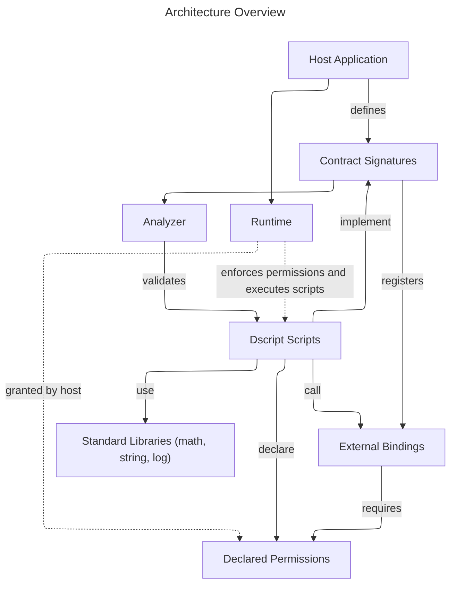

# Dscript Overview

Dscript is a small scripting language intended for plug‑in style extensions in Dart applications. It includes a parser, static analyzer and fully featured runtime for executing compiled scripts.

This guide covers the language syntax and how to integrate scripts with a Dart host. Sections marked as **Work in Progress** describe features that are not implemented in the current version.

