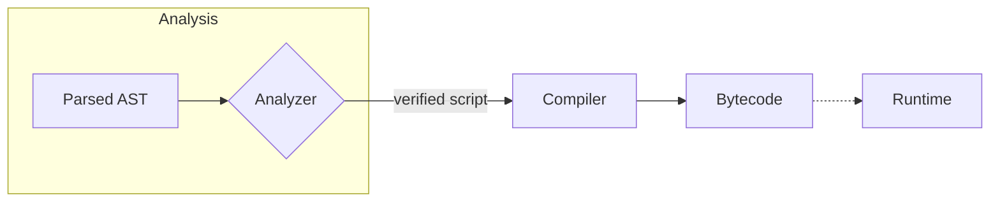

# Compiler Overview

Dscript includes a bytecode compiler that transforms the
analyzed abstract syntax tree (AST) into a compact representation, which is then executed by the runtime via a virtual machine.



The compiler is invoked after static analysis via the `compile` function:

```dart
final result = analyze(InputStream.fromString(code), [myContract]);
final compiled = compile(result.getOrThrow());
```

Each implementation, hook and top level function is compiled
independently. The result is a `CompiledScript` holding bytecode
functions and the script's declared permissions.

## Bytecode Structure

Bytecode consists of a buffer of opcodes and a constant pool. During
compilation the compiler emits instructions that operate on a stack and
refer to constants by index. The [`BufferDebugX` extension](../../lib/src/compiler/debug.dart)
can be used to print a human readable dump of the bytecode.

```dart
print(fn.toDebugString());
```

## Naïve Compiler

The default `NaiveCompiler` assumes the script is valid and does not
perform additional checks. You may provide your own compiler by
supplying a custom `Compiler` implementation to the `compile` function.

```dart
final compiled = compile(script, (globals) => MyCompiler(globals));
```
